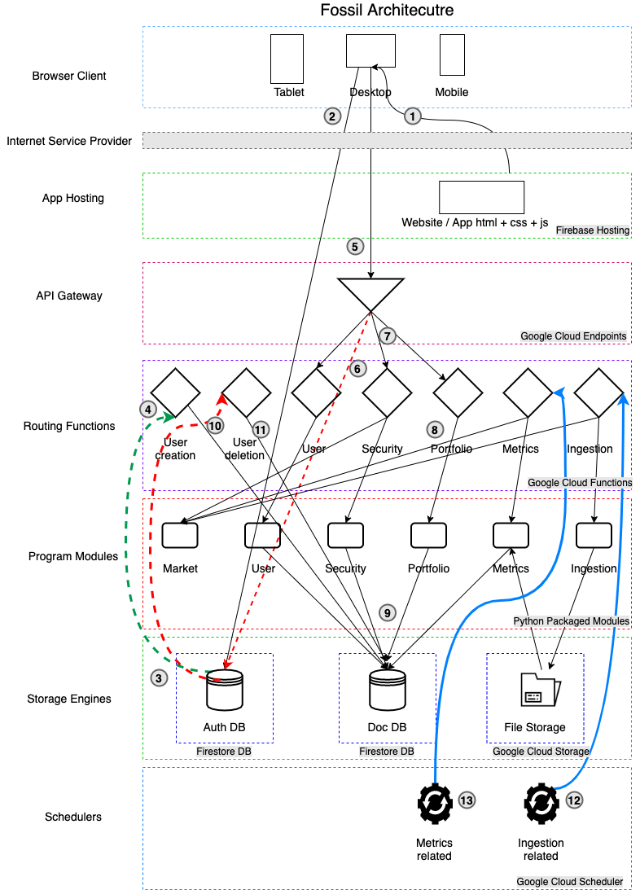

# Architectural Overview

### Steps
1. The website or app is a browser based one built using Progressive Web Application (PWA) features. Calling it from a browser on your device (desktop, mobile or tablet), will download relevant pages and cache them on the device.
2. On Signup (or Login) from the app, makes a direct call to the Auth DB and logs in the user if credentials are correct.
3. If user has registered for the first time, it triggers a **User Creation** function.
4. This will do some _housekeeping_ tasks in the Doc DB.
5. Functionality in the App (in the form of links) will make a call to the API Gateway.
6. This will authenticate the call from the user by validating the token with the Auth DB
7. Once validated, the request from the user is sent to the respective Routing Function that is specified in the configuration of the API gateway.
8. Each of the routing function will invoke the core business logic from the Program modules.
9. The program modules in turn will process the request and make requests and updates to the Doc DB. _Steps 5 to 9 continue for all links._
10. In case the user de-registers from the system, the Auth DB will make a call to the **User Deletion** function.
11. This will do some _cleanup_ tasks for that user in the DB.
12. On a regular basis, scheduler jobs will undertake the tasks of downloading data from different sources using the **Ingestion** routing functions
13. On a regular basis, scheduler jobs will undertake the tasks of updating metrics using data from different sources stored in the File storage.

### Technology Platform
>The whole platform has been automised for a Serverless Computing Environment on Google Cloud Platform (GCP)

1. `Client`: This being a PWA, any **modern browser** would be required to access the Website / Application.
2. `App Hosting`: The basic html screens, style sheets and javascript files used by the client as hosted in a **Firebase Hosting Environment** (that supports dynamic templating using Node JS).
3. `API Gateway`: The **Google Cloud Endpoints** (which internally uses _Google Cloud Run_) is used as an API gateway. The config is done using Swagger 2.0 specs.
4. `Routing Functions`: Currently, they have been configured as Serverless function using **Google Cloud Functions**. They have been coded in _Python_.
5. `Program Modules`: The core functionality has been organised into logical modules which are called from the Routing Functions. They have been coded in _Python_.
6. `Auth DB`: The authentication of users is being done in **Firestore**.
7. `Doc DB`: All the data required by Fossil is stored in a nonsql database viz. **Firestore**.
8. `Scheduler Engine`: **Google Cloud Scheduler** is being used to run daily and periodic tasks like ingestion and metrics updates.
